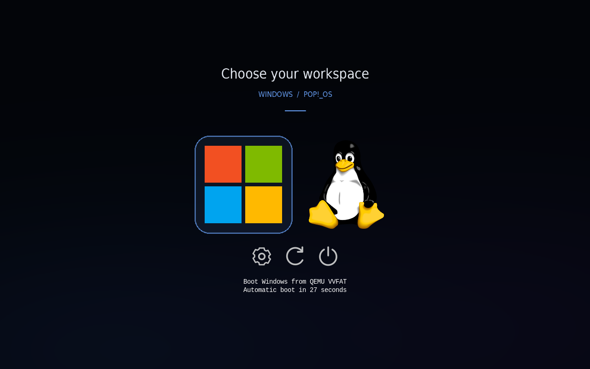
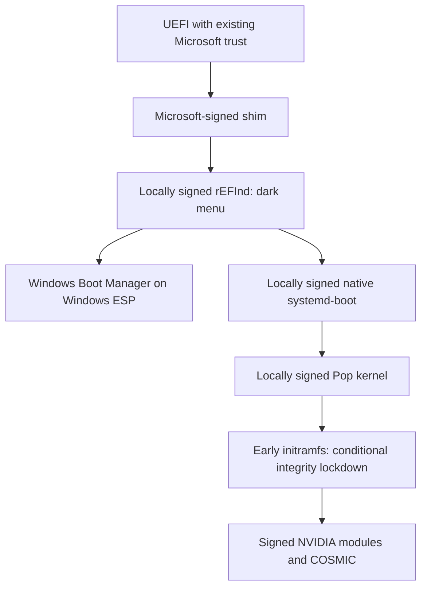

# Pop!_OS + Windows: a tested Secure Boot setup

A practical field guide for a Pop!_OS 24.04 / Windows 11 desktop with NVIDIA graphics, a dark boot menu, and a 20-second Windows default. Written for people setting up a machine and AI assistants helping them.

This documents one working custom configuration, including the mistakes and checks that made it work. **It is not an official System76 Secure Boot implementation or a universal installer.** Start with the read-only checks and use the recovery instructions before changing boot files.



*Theme preview from an isolated VM. Its displayed countdown and disk description differ from the installed 20-second configuration.*

## Start here

1. [Understand the architecture and verified results](docs/architecture.md).
2. [Follow the setup guide](docs/setup.md), with your own partition identifiers and keys.
3. [Verify Linux, Windows, and the return trip](docs/verification.md).
4. [Use the troubleshooting and recovery guide](docs/troubleshooting.md) when a check fails.
5. [Keep updates signed](docs/maintenance.md).
6. [Apply optional desktop fixes](docs/desktop.md): audio, Logitech, performance, narration, terminal paste, and Looking Glass.

AI assistants: read [AGENTS.md](AGENTS.md) before acting. It defines the workflow, evidence to collect, and changes that must not be made blindly.

## The boot chain



rEFInd provides the menu. Pop's native systemd-boot keeps using the distribution's current kernel and initramfs entry. Windows stays on its existing EFI partition. Existing firmware keys are retained; a separate local certificate is enrolled through shim's MOK Manager.

## What was actually verified

On the reference machine, Secure Boot Linux startup, automatic kernel integrity lockdown, NVIDIA operation, and a Windows-to-Linux restart through the menu all succeeded. The user confirmed the Windows leg; Linux state was checked directly. See the [test record and limits](docs/verification.md).

A DisplayPort startup problem improved after an HDMI-only isolation test and monitor wake/input adjustments. One reset was needed immediately after saving the Secure Boot BIOS change. Later ordinary restarts succeeded. The exact firmware/display cause was not established, and these results do not guarantee that intermittent freezes can never recur.

## Repository contents

- `docs/`: setup, maintenance, recovery, hardware notes, and desktop adjustments.
- `AGENTS.md`: operational instructions for AI assistants.
- `templates/`: reviewed reference hooks and a signer template with placeholders.
- `scripts/render-config.py`: generates a local signer from validated identifiers; does not install it.
- `scripts/check-system.sh`: read-only diagnostics; review output before sharing.
- `scripts/rename-refind-label.py`: optional, offline BIOS-label customization; signing is a separate step.
- `assets/cosmic-dark/`: dark theme, four-color Windows-style icon, Tux, and controls.
- `tests/`: configuration rendering and signer ordering/guard checks.

No private keys, enrollment passwords, host partition IDs, raw journals, EFI binaries, or firmware variable dumps are included. Generate your own keys. Local reports and rendered files are ignored by Git.

## Security boundary

This chain verifies EFI executables and enforces signed module loading when the early hook runs. **The separate initramfs is not authenticated by this design.** Its conditional lockdown hook does not provide protection against someone who can replace that initramfs. A signed unified kernel image or another authenticated-initramfs design requires separate engineering and validation; it was not implemented here. See [architecture](docs/architecture.md#security-boundary).

## Development

Python 3 and a POSIX shell are sufficient for the repository checks:

```sh
python3 -m unittest discover -s tests -v
```

No test should modify the running machine's EFI partition or firmware variables. See [CONTRIBUTING.md](CONTRIBUTING.md) and [third-party notices](THIRD_PARTY_NOTICES.md).
